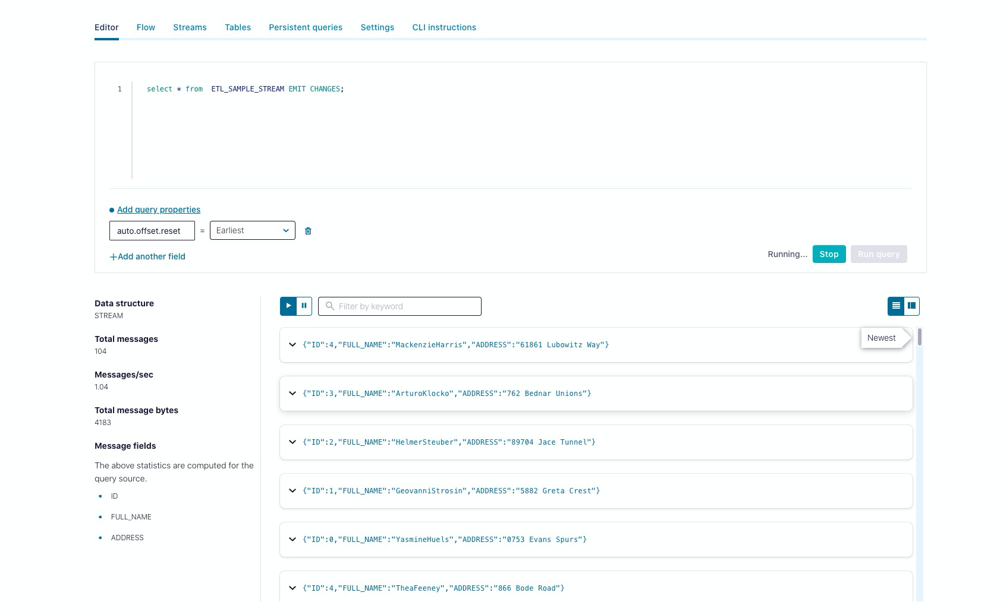

Set up `ProducerExample.java` . This topic will be created if it doesn't exist
    Set up all the configuration parameters in the ProducerExample()
    Default properties are set in the defaultProps static Map

Run `mvn clean`

Run `mvn install` -> This will generate the schema off of `io.confluent.examples.clients.cloud.csutomer-v1.avsc` file

Set up a KsqlDB Stream on the topic `sample` :
``` 
    * Create a ksqldb application on Confluent Cloud
    
    * Create a Stream off of the sample topic:
        CREATE STREAM sample_stream WITH (
        KAFKA_TOPIC = 'sample',
        VALUE_FORMAT = 'AVRO'
      );
    * Do some manipulations on the messages that arrive on the sample_stream and create another stream derived from it
        * CREATE STREAM etl_sample_stream
            AS 
            SELECT 
            COUNT AS ID,
            FIRST_NAME + LAST_NAME AS FULL_NAME,
            ADDRESS AS ADDRESS
            FROM sample_stream
            emit changes;
        * The above statement will create a FULL_NAME field derived from FIRST_NAME + LAST_NAME    
    * Run ProducerExample.java. This will produce 5 records in a topic called `sample` 
    * Query the ETL stream and see the messages using the KSQL editor or the REST API:
        select * from  ETL_SAMPLE_STREAM EMIT CHANGES;
        
           That creates a push query which will keep emitting results as you produce to the topic sample.
           
    
```

